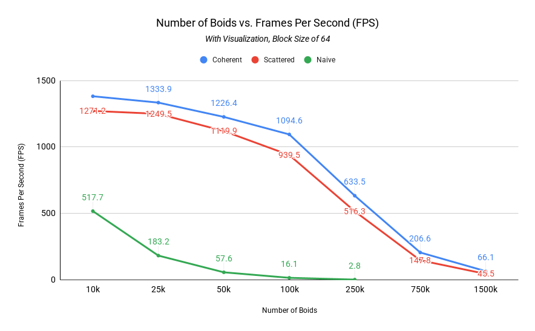
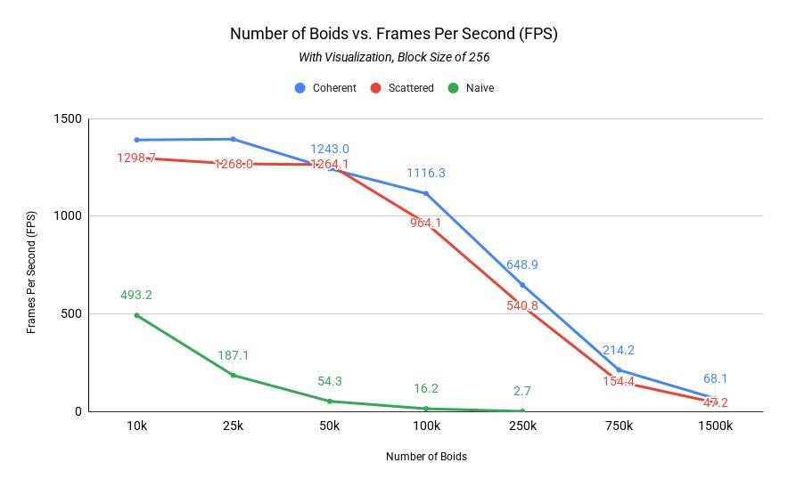
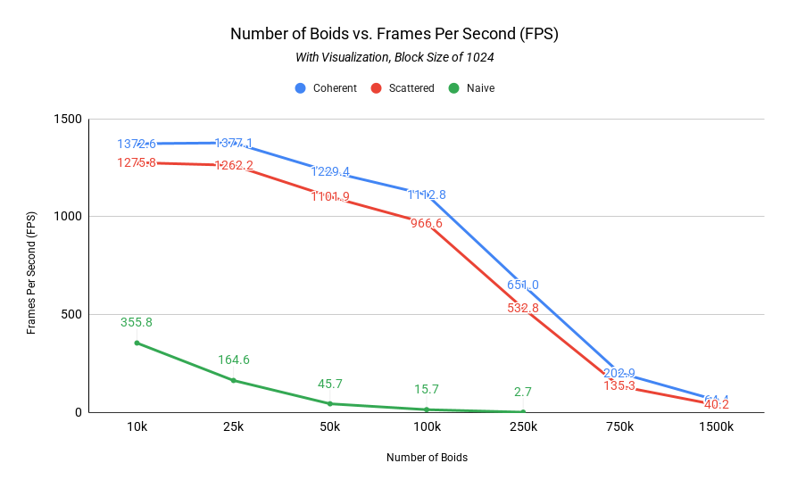
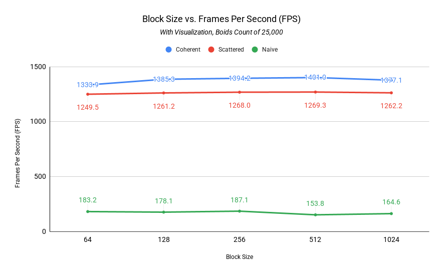
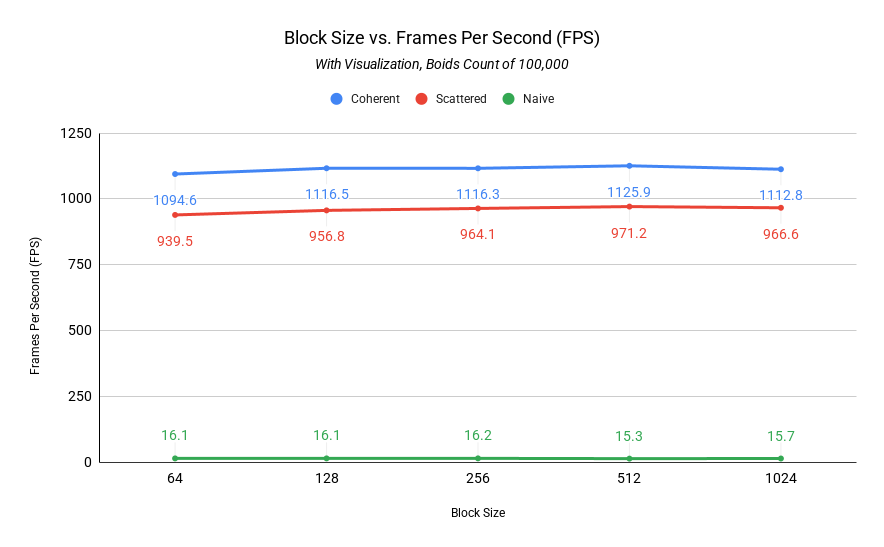
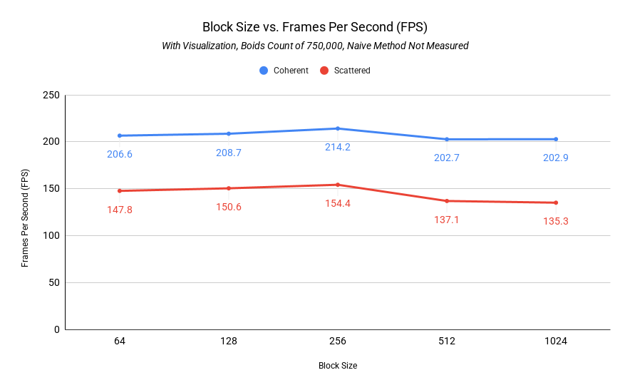

**University of Pennsylvania, CIS 5650: GPU Programming and Architecture,
Project 1 - Flocking**

* Charles Wang
  * [LinkedIn](https://linkedin.com/in/zwcharl)
  * [Personal website](https://charleszw.com)
* Tested on:
  * Windows 11 Pro (26100.4946)
  * Ryzen 5 7600X @ 4.7Ghz
  * 32 GB RAM
  * RTX 5060 Ti 16 GB (Studio Driver 580.97)

# CUDA Boids Flocking Simulation

||||
|:----------:|:----------:|:-----------:|
|_25,000 boids_|_50,000 boids_|_125,000 boids_|

In this project I implemented the Boids flocking simulation in CUDA. The implementation is based on pseudocode from [Conrad Parker's notes](https://vergenet.net/~conrad/boids/pseudocode.html) and modified as needed in order to run on CUDA (each thread updates the position for one boid). There are two main implementations:

* **Naive:** for each boid, look at every other boid in the scene and adjust velocity and position accordingly.
* **Uniform grid:** add an additional preprocessing step where boids are grouped into 3D grid cells. For each boid, we only have to check the boids in its own grid cell as well as neighboring cells.

## Performance analysis

### Testing methodology

For testing, I mainly looked at the frames per second (FPS) of each implementation (naive, scattered uniform grid, coherent uniform grid). To do this, I wrote additional code that automatically closed the program after 20 seconds of simulation, and kept track of all framerates every second. Then, I would record the average FPS across the 20 seconds.

There were two parameters that I varied across testing: the block size (number of threads) and the number of boids to simulate. I then ran the benchmark for each possible combination of these variables:

* Block size: 64, 128, 256, 512, 1024
* Number of boids: 10k, 25k, 50k, 100k, 250k, 750k, 1500k

The raw data is available as CSV files in the [`analysis`](https://github.com/aczw/Project1-CUDA-Flocking/tree/main/analysis) folder. Rows are boid count in increasing order, columns are block size in increasing order.

### Graphs

#### Varying boid count

The first set of graphs look at how the average framerate varies across the boid count. I selectively picked benchmarks for block sizes of 64, 256, and 1024.

|No visualization|With visualization|
|:-:|:-:|
|||
|||
|||

#### Varying block sizes

The second set of graphics look more closely at how the average framerate varies across the different block sizes. I selectively picked benchmarks for boid counts of 25k, 100k, and 750k. You'll notice that I'm missing data for the naive method when the boid count was 750k. This is because the simulation ground to a halt, and there was no effective way to measure the framerate anymore (effectively it was zero).

|No visualization|With visualization|
|:-:|:-:|
|||
|||
|||

###

> For each implementation, how does changing the number of boids affect performance? Why do you think this is?

Unsurprisingly, increasing the boid count for each implementation made the framerate drop. The slope held still for a bit until 100k boids, at which point the slope became much steeper for all three. Coherent uniform consistently performed better than scattered uniform, and both left naive in the dust. The use of the uniform grid data structure really helped reduce the number of calculations and checks the CUDA kernel had to perform, therefore allowing us to calculate velocities and positions much faster.

> For each implementation, how does changing the block count and block size affect performance? Why do you think this is?

Surprisingly, changing the block size did not make much of a difference. I assume it's because we're simulating so many boids that we're essentially hitting the ceiling no matter which block size we use? I do observe a "peak" in performance when I set the block size at 256. I do not really understand why. 

> For the coherent uniform grid: did you experience any performance improvements with the more coherent uniform grid? Was this the outcome you expected? Why or why not?

Yes, I achieve performance improvements, but it was lower than I expected. The results make sense though. By allowing physically adjcent grid cells to also be contiguous in memory, this reduces potential cache misses and improves memory access times because the locations are less random.

> Did changing cell width and checking 27 vs 8 neighboring cells affect performance? Why or why not? Be careful: it is insufficient (and possibly incorrect) to say that 27-cell is slower simply because there are more cells to check!

Unfortunately I never did the 27 neighbor cell check.

## Extra credit

I implemented the grid-looping optimization when performing the neighbor search for adjacent grid cells. Instead of hardcoding a check for the 7 or 27 possible neighbor cells, we instead operate based on a "max distance" from the current boid, and include all neighboring grid cells which are within this max distance radius.

This was as simple as translating `maxDistance` in all three cardinal directions, in the positive and negative, to find the max and min grid cell index respectively. We then perform a triple for-loop iteration over all grid cells within this boundary, and sum up the contributing velocities.
